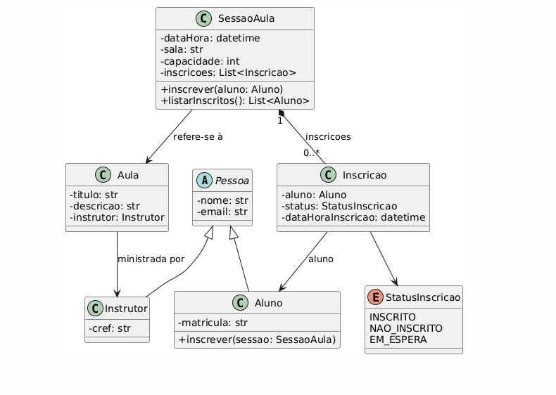

# 🏋️‍♂️ Sistema Gerenciador de Aulas de Academia  
Projeto final da disciplina **Tecnologia Orientada a Objetos (TOO)** – IFSul (Campus Passo Fundo)

Este projeto implementa um sistema orientado a objetos em Python para gerenciar **aulas**, **sessões de aula**, **alunos**, **instrutores** e **inscrições**, utilizando **encapsulamento, herança, polimorfismo**, **abstração**, além dos padrões de projeto **Factory** e **Strategy**.

---

<p align="center"> 
 
 
 
</p>

## 🎯 Objetivo do Projeto
O objetivo é modelar e implementar um sistema simples, mas estruturado, para uma academia, permitindo:

- Cadastro de modalidades (Aula)
- Criação de sessões de aula (SessaoAula)
- Inscrição de alunos com controle de capacidade
- Fila de espera e estratégias alternativas de lotação
- Instanciação automática de modalidades via Factory
- Aplicação dos pilares da Programação Orientada a Objetos

---

## 📌 Diagrama de Classes (UML)

O diagrama utilizado como base no projeto representa as seguintes classes:  
**Pessoa**, **Aluno**, **Instrutor**, **Aula**, **SessaoAula**, **Inscricao**



---

## 🧱 Estrutura das Classes e Pilares de POO
#### Abaixo está a descrição de cada classe e como os pilares de POO foram aplicados.

### 🔹 Classe Pessoa (Classe Base Abstrata)
- Atributos: nome, email
- Métodos comuns às subclasses
- **Pilar aplicado:**
    - **✔ Herança** (base para Aluno e Instrutor)
    - **✔ Abstração** (representa um conceito genérico)

### 🔹 Classe Aluno (Herda de Pessoa)
- Atributos adicionais: matricula
- Representa o aluno da academia
- **Pilar aplicado:**
    - **✔ Herança**

### 🔹 Classe Instrutor (Herda de Pessoa)
- Atributos adicionais: cref
- Representa o professor da modalidade
- **Pilar aplicado:**
    - **✔ Herança**

### 🔹 Classe Aula
- Define uma modalidade: ***Pilates, Yoga, Funcional…***
- Atributos: titulo, descrição, instrutor, duração
- **Pilares aplicados:**
    - **✔ Encapsulamento** (getters e setters)
    - **✔ Polimorfismo** (exibir dados adaptado)

### 🔹 Classe SessaoAula
- Define uma ocorrência da aula: ***data_hora, sala, capacidade***
- Associa uma Aula a uma turma real
- Gerencia inscrições
- **Pilares aplicados:**
    - **✔ Encapsulamento**
    - **✔ Polimorfismo** (__str__ e exibir_dados)
    - **✔ Herança indireta** (com objetos de Aula, Inscricao, Aluno)

### 🔹 Classe Inscricao
- Relaciona um Aluno a uma SessaoAula
- Atributos: status, data_hora_inscricao
- Controla estados: inscrito, em espera, não inscrito

--- 

##  🧩 Padrões de Projeto Utilizados
### **🏭 1. Factory (AulaFactory)**

O **Factory Method** é um padrão de criação que centraliza e abstrai a lógica de construção de objetos.  
Ele evita a repetição de código, reduz erros e facilita a criação de instâncias complexas.

No contexto deste projeto, o Factory é responsável por **criar automaticamente modalidades de Aula**, já com:

- Título padronizado  
- Descrição da modalidade 
- Duração fixa  
- Instrutor especializado para aquela modalidade  

***Isso evita que o restante do sistema tenha que conhecer detalhes de cada modalidade.***

---

### 📌 Por que usar o Factory neste projeto?
- Cada modalidade tem regras próprias (descrição, duração e professor).
- Centraliza a criação das aulas.
- Evita duplicação de código.
- Torna o sistema mais fácil de manter e expandir.
- Permite adicionar novas modalidades sem alterar outras classes .

---

### 📌 Implementação usada no projeto
Arquivo: `factories/aula_factory.py`

---


### 🔀 **Strategy – Estratégias de Lotação da Sessão**
O padrão **Strategy** permite alterar o comportamento de uma classe **sem mudar sua estrutura**. 

Ele encapsula algoritmos (estratégias) em classes separadas, permitindo trocar a lógica em tempo de execução.

Neste projeto, o Strategy define **como a Sessão de Aula decide o status da inscrição**.

---

### 📌 Por que usar Strategy aqui?
Cada academia pode ter uma política diferente de como lidar com turmas cheias:

- Algumas usam **fila de espera**  
- Outras não permitem espera e rejeitam a inscrição  

Usar Strategy permite trocar essa regra sem modificar a classe SessaoAula, garantindo:

- baixo acoplamento  
- maior flexibilidade  
- código mais limpo  
- facilidade de manutenção  

---

### 📌 Implementação usada no projeto
Arquivo: `strategies/lotacao.py`

---

## 🛠️ Tecnologias Utilizadas
- **Python 3.10+**
- Programação Orientada a Objetos (POO)
- Aplicação dos padrões **Factory** e **Strategy**
- Organização em múltiplos módulos e pacotes (`models/`, `factories/`, `strategies/`, `tests/`)
- Uso de **Enums** para representar estados de inscrição
- Manipulação de datas com `datetime`
- Testes manuais e automatizados através de scripts na pasta `/tests`

---

## ▶️ Como Executar o Projeto

#### **1. Clone o repositório:**

```bash
git clone https://github.com/lucasteixeira03/Gerenciador-Aulas.git
```

#### **2. Certifique-se de que está usando Python 3.10+**
```
python --version
```

#### **3. Execute os testes**
#### 🧪 Teste Aluno e Instrutor (arquivo teste_Aluno-Instrutor.py)
Execute no terminal:
```
python tests/teste_Aluno-Instrutor.py
```

#### 🧪 Teste Aula (arquivo teste_Aula.py)
```
python tests/teste_Aula.py
```

#### 🧪 Teste Aula Factory (arquivo teste_aulaFactory.py)
```
python tests/teste_aulaFactory.py
```

#### 🧪 Teste Inscrições (arquivo teste_inscricao.py)
```
python tests/teste_inscricao.py
```

#### 🧪 Teste Sessão Aula (arquivo teste_sessaoAula.py)
```
python tests/teste_sessaoAula.py
```

#### 🧪 Teste Strategy (arquivo teste_Strategy.py)
```
python tests/teste_Strategy.py
```

#### Durante a execução dos testes, você verá:
- Criação de instrutores
- Instanciação de aulas (manual e via Factory)
- Criação de sessões de aula
- Inscrição de alunos
- Comportamento da estratégia padrão (fila de espera)
- Comportamento da estratégia alternativa (sem fila de espera)

---

####

<p align="center"> 
 
 
 </p>

<p align="center"> <strong>Lucas de Sousa Teixeira</strong><br> Estudante de Ciência da Computação – IFSul Campus Passo Fundo </p> <p align="center"> <a href="https://github.com/lucasteixeira03">  </a> </p>


